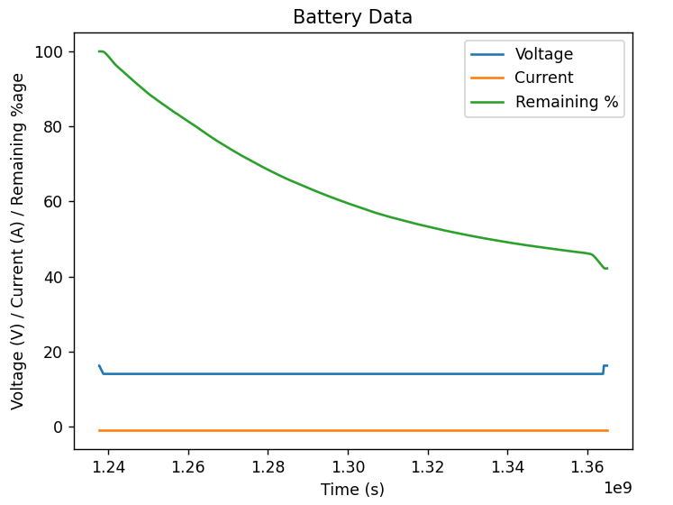

# Parseulog

Python wrapper/custom parser for the px4/pyulog tool.

### Prerequisites

> pip install -r requirements.txt

### Steps to use the custom parser

> python parse.py /path/to/ulog/file --plot

_Note: --plot is an optional command line argument passed when we want to see a graph plotted, if we ignore the --plot flag, data will be printed to the std out_

Example:

> python parse.py data\04_50_04.ulg --plot

Sample Output:

PS:

- [Click here](https://colab.research.google.com/drive/1cARDaIMDjlgFP0576XHSIM-iw-fWd5kc?usp=sharing) for Google Colab Notebook for the (Work in Progress) Linear Regression Code.
- [Click here](https://drive.google.com/drive/folders/1_sVq_knf5e3uOsekkdqtlBMHqojOmzbG?usp=sharing) for more sample ulog data files.
